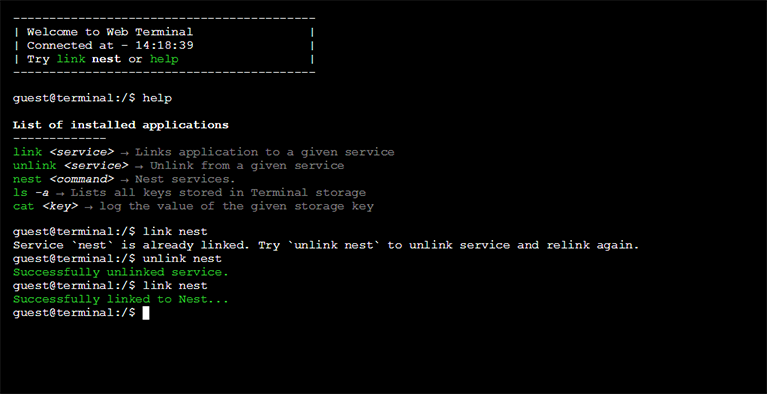

# Web CLI Connectivity Demonstration

A demonstration web-based unix-esque CLI for interacting with devices/services such as Nest.

*Note that the CLI rendering relies on code from the wonderful CLI [xkcdfools](https://github.com/chromakode/xkcdfools) but has been improved to provide a richer experience.*

------------



## Getting started
### Service configuration
In order to use Linked services (only Nest is available for this demo) configure `const NestClientID` in `./lib/Applications/Link.js` and `./server.js` to your [Nest developer's](https://developer.nest.com/) *Product ID* and set *Redirect URI* directly to the main page of the Web Interface.

Next set environmental variable `NESTSECRET` to your Nest developer's *Product Secret*. Note that this secret is **only used with the Node.js back-end** and is not exposed to the client.

### Launch Web CLI
To launch a development server simply clone this repository and run the following commands within the cloned directory:
```
npm install
npm start
```
This will build the client code with **Browserify** and launch a development server on port 9080.

## Design choices
### OAuth2 in iframes?!
`sandboxed iframes` are used to handle inline widgets within the interface for OAuth2 authorization. As a developer I strongly advise to use popups to keep a great experience and equally be compliant to the specifications. I am not alone in with this opinion, [Nest's docs](https://developer.nest.com/documentation/cloud/authorization-overview) and the [OAuth v2 specs](http://tools.ietf.org/html/draft-ietf-oauth-v2-23#section-10.13) advise against the use of embedded frames. Regardless this is a demonstration project and would not have any real-world implications.

### Localstorage as CLI storage
Almost all information that is persistent is stored in the browser's `localstorage`. Information such as `access_token` and command history are examples of such stored objects. You can list and view them using `ls` and `cat` inspired by Unix FS:
```shell
> ls
@Terminal::Storage::@Link::access_token::nest

> cat @Terminal::Storage::@Link::access_token::nest
""c.F52PZVdy..."
```

### Back-end token to access_token convertor
A small API is provided at **GET** `get_token/:service` to convert tokens received by client auth to access_tokens. You can take a look at the code in `server.js` file of the repository. Client token is provided as query parameter `code`. An example of such request is:
```
GET - http://localhost:9080/get_token/nest?code=fxfd...
```
which in turn responds with:
```json
{
  "access_token": "...",
  "expires": 35135
}
```
